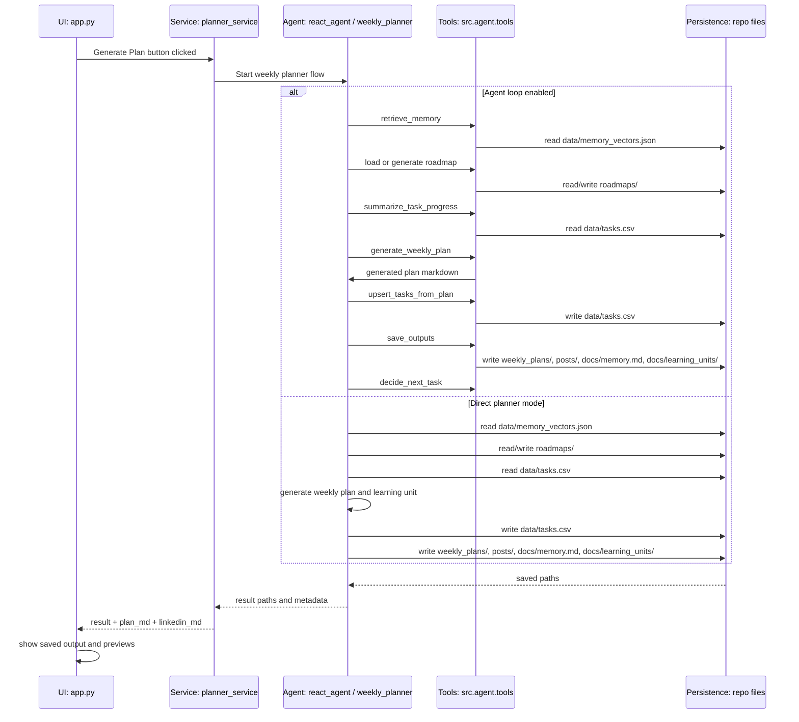

# Architecture

# Architecture Status

| Version | Status | Description |
|---------|--------|-------------|
| V1 | ✅ Implemented | Current task-based learning architecture |
| V2 | 🚧 Planned | Day-centric learning architecture (this document) |

## Purpose

The AI Career Accelerator is a Streamlit-based learning planner.

Its main job is to take a user learning goal and produce:

- a weekly learning plan
- a LinkedIn draft
- learning units
- task updates
- memory updates
- roadmap progress metadata

The goal of this document is to describe how the system currently works, not how it should be redesigned.

---

## High-Level Execution Flow

```text
UI
Generate Plan button
  ↓
Service
run_weekly_planner_service()
  ↓
Agent / Planner
ReAct planner agent OR direct weekly planner
  ↓
Tools / Planner functions
memory retrieval
roadmap loading/generation
task progress summary
weekly plan generation
task upsert
save outputs
next task selection
  ↓
Persistence
weekly_plans/
posts/
docs/memory.md
data/memory_vectors.json
data/tasks.csv
docs/learning_units/
data/traces/
roadmaps/
  ↓
UI preview
```

---

## Entry Point

The main UI entry point is:

```text
app.py
```

The user enters planner inputs in the Streamlit sidebar and clicks:

```text
Generate plan
```

That button calls:

```text
run_weekly_planner_service()
```

The UI does not directly run the agent or planner logic. It delegates to the service layer.

---

## Planner Service

`run_weekly_planner_service()` is the bridge between the Streamlit UI and the planner execution engines.

It is responsible for:

```text
1. ensuring required data directories exist
2. preparing inputs
3. choosing execution mode
4. calling either ReAct mode or direct mode
5. normalizing result paths
6. preparing markdown previews
7. returning a consistent response to app.py
```

There are two execution modes:

```text
ReAct mode
Direct planner mode
```

### ReAct Mode

```text
run_weekly_planner_service()
  ↓
build preferences_payload
  ↓
run_weekly_planner_agent_react()
  ↓
agent saves files
  ↓
service reads saved plan/linkedin files back
  ↓
return preview + paths
```

In ReAct mode, the agent loop controls the sequence of tool calls.

### Direct Planner Mode

```text
run_weekly_planner_service()
  ↓
enrich preferences_text
  ↓
generate_and_save_week()
  ↓
planner saves files
  ↓
service splits raw markdown
  ↓
return preview + paths
```

In direct planner mode, `generate_and_save_week()` performs the orchestration directly, without the ReAct controller.

Both modes return the same shape to `app.py`:

```python
{
    "result": normalized,
    "plan_md": plan_md,
    "linkedin_md": linkedin_md,
}
```

This means the UI is mostly execution-mode agnostic.

---

## Call Hierarchy

```text
app.py
└── Generate Plan button
    └── run_weekly_planner_service()
        ├── Agent mode enabled
        │   └── run_weekly_planner_agent_react()
        │       ├── tool_retrieve_memory()
        │       ├── tool_load_learning_roadmap()
        │       ├── tool_generate_learning_roadmap()
        │       ├── tool_summarize_task_progress()
        │       ├── tool_generate_weekly_plan()
        │       │   └── generate_weekly_plan_and_learning_unit()
        │       ├── tool_upsert_tasks_from_plan()
        │       ├── tool_save_outputs()
        │       │   └── save_week_files()
        │       └── tool_decide_next_task()
        │
        └── Agent mode disabled
            └── generate_and_save_week()
                ├── memory search
                ├── roadmap load/generation
                ├── task progress summary
                ├── generate_weekly_plan_and_learning_unit()
                ├── upsert_tasks_from_plan()
                ├── save_week_files()
                └── append_memory_snippet()
```

---

## Sequence Diagram



---

## Persistence Targets

The planner flow reads from and writes to local repository files.

```text
weekly_plans/week_<timestamp>_plan.md
posts/linkedin_week_<timestamp>.md
docs/memory.md
data/memory_vectors.json
data/tasks.csv
docs/learning_units/<timestamp>_<slug>.md
data/traces/trace_<timestamp>.json
roadmaps/<roadmap_id>_roadmap.json
roadmaps/<roadmap_id>_roadmap.md
```

---

## Current Understanding

The system has two planner execution paths.

### ReAct Mode

The ReAct controller decides which tool to call next. It gradually builds state, executes tools, saves outputs, and records a trace.

### Direct Planner Mode

The direct planner function performs the planning flow itself. It does not use the ReAct controller.

In both cases, the system ends by saving files and returning preview markdown to the UI.

---

## Still To Document

```text
[ ] Controller responsibilities
[ ] State object in ReAct mode
[ ] Tool inventory
[ ] Memory flow
[ ] Task flow
[ ] Roadmap flow
[ ] Quiz flow
[ ] Critic flow
[ ] Persistence/data model
```

## Controller Responsibilities

The ReAct controller lives in:

```text
src/agent/react_agent.py
```

Its main function is:

```text
run_weekly_planner_agent_react()
```

The controller is responsible for deciding the next step in the planner workflow. It does not directly generate the weekly plan content itself. Instead, it chooses which tool should run next.

### Note:
Product perspective:
ReAct agent is probably overkill right now.

Portfolio / learning perspective:
ReAct agent is useful because it shows you understand agent controllers, tool routing, traces, and state.

---

## What the Controller Controls

The controller manages the execution order of these tools:

```text
retrieve_memory
load_learning_roadmap
generate_learning_roadmap
summarize_task_progress
generate_weekly_plan
upsert_tasks_from_plan
save_outputs
decide_next_task
```

These tools are registered in `TOOL_DISPATCH`.

---

## Controller Loop

At each step, the controller:

```text
1. looks at current state
2. builds a controller prompt
3. asks the LLM which action to take next
4. parses the LLM response as JSON
5. validates the selected action
6. applies safety overrides if needed
7. calls the selected tool
8. updates state with the tool output
9. records the step in the trace
10. repeats until final result or max steps
```

---

## Controller State

The controller keeps a state object with information such as:

```text
goal
hours_per_week
max_session_minutes
preferences

memory_context
memory_attempted
memory_used
memory_hits

roadmap_attempted
roadmap_exists
roadmap_generated
roadmap_path
roadmap_id

task_progress_summary
open_tasks_count
needs_review_count
weak_topics

weekly_plan_md
linkedin_post_md
learning_unit_md
memory_snippet

tasks_upserted
weekly_plan_path
linkedin_path
learning_unit_path
memory_path

next_task

critic_report
critic_status
```

This state tells the controller what has already happened and what still needs to happen.

---

## Controller Decision Policy

The controller follows a mostly linear pipeline:

```text
1. retrieve memory
2. load or generate roadmap
3. summarize task progress
4. generate weekly plan
5. upsert tasks from plan
6. save outputs
7. decide next task
8. final result
```

The controller prompt tells the LLM not to generate the plan directly. The LLM must return either:

```json
{"action": "tool", "tool_name": "...", "args": {...}}
```

or:

```json
{"action": "final", "result": {...}}
```

---

## Safety and Guardrails

The controller has several guardrails:

```text
- do not retrieve memory more than once
- do not repeatedly generate the same roadmap
- do not finalize before a weekly plan exists
- enforce required pipeline order if the LLM chooses the wrong next tool
- stop if the same tool repeats too many times
- stop if the controller cannot produce valid JSON
- write a trace file for debugging
```

This means the LLM suggests the next action, but the Python controller still enforces progress and safety.

---

## Trace Output

Each controller/tool step is recorded as a trace entry.

Trace files are saved to:

```text
data/traces/trace_<timestamp>.json
```

Each trace entry includes:

```text
step_name
tool_name
tool_input
tool_output_summary
tool_output_full
timestamp
```

The trace file is useful for understanding why the agent called certain tools and what each tool returned.

---

## Important Understanding

The ReAct controller is not the “planner brain” that writes the learning plan.

Its real responsibilities are:

```text
- sequencing
- state tracking
- tool routing
- safety overrides
- trace logging
- final result assembly
```

The actual weekly plan content is generated later by:

```text
tool_generate_weekly_plan()
  ↓
generate_weekly_plan_and_learning_unit()
```

## Tool Inventory and Tool Flow

In ReAct mode, the controller does not perform the work directly. It chooses tools from the tool layer.

The tool layer lives in:

```text
src/agent/tools.py
```

The ReAct controller uses these tools:

| Tool | Responsibility | Reads | Writes |
|---|---|---|---|
| `tool_retrieve_memory` | Finds relevant past memory snippets for the current goal | `data/memory_vectors.json` | Nothing |
| `tool_load_learning_roadmap` | Loads an existing roadmap if one exists | `roadmaps/*_roadmap.json` | Nothing |
| `tool_generate_learning_roadmap` | Creates a new roadmap and seeds roadmap tasks | LLM response, may read `data/tasks.csv` | `roadmaps/*_roadmap.json`, `roadmaps/*_roadmap.md`, may update `data/tasks.csv` |
| `tool_summarize_task_progress` | Summarizes current task state | `data/tasks.csv` | Usually nothing, but may rewrite CSV during schema migration |
| `tool_generate_weekly_plan` | Generates weekly plan, LinkedIn draft, learning unit, and memory snippet | May read `data/tasks.csv` if roadmap context exists | Nothing |
| `tool_upsert_tasks_from_plan` | Extracts tasks from generated plan and updates task store | `data/tasks.csv` | `data/tasks.csv` |
| `tool_save_outputs` | Saves generated plan artifacts and updates memory | May read `data/memory_vectors.json` | `weekly_plans/`, `posts/`, `docs/learning_units/`, `docs/memory.md`, `data/memory_vectors.json` |
| `tool_decide_next_task` | Picks the next suggested task from the generated plan | Nothing | Nothing |

---

## Tool Flow in ReAct Mode

```text
run_weekly_planner_agent_react()
  ↓
tool_retrieve_memory()
  ↓
tool_load_learning_roadmap()
  ↓
tool_generate_learning_roadmap() if no roadmap exists or force regenerate is enabled
  ↓
tool_summarize_task_progress()
  ↓
tool_generate_weekly_plan()
  ↓
tool_upsert_tasks_from_plan()
  ↓
tool_save_outputs()
  ↓
tool_decide_next_task()
  ↓
final result
```

---

## Important Tool Boundary

The controller decides **which tool to call next**.

The tools do the actual work:

```text
Controller = sequencing and state management
Tools = reading, writing, generating, summarizing, saving
```

The most important content-generation tool is:

```text
tool_generate_weekly_plan()
```

This tool calls:

```text
generate_weekly_plan_and_learning_unit()
```

That function produces:

```text
weekly_plan_md
linkedin_post_md
learning_unit_md
memory_snippet
```

The actual persistence step happens later in:

```text
tool_save_outputs()
```

So the ReAct flow separates generation from saving:

```text
generate_weekly_plan = create content in memory/state
save_outputs = persist content to files
```

## Memory Flow

The system maintains long-term learning memory using a vector store.

Memory serves one purpose:

```text
Help future plans take previous learning activity into account.
```

The memory subsystem consists of two stores:

```text
docs/memory.md
```

Human-readable memory history.

```text
data/memory_vectors.json
```

Vector database used for semantic retrieval.

---

### Memory Structure

Each memory entry contains:

```text
MemoryItem
├─ id
├─ text
├─ embedding
└─ metadata
```

The stored text is usually a short summary of what was learned, completed, or planned during a week.

---

### Memory Retrieval

Memory retrieval occurs at the beginning of plan generation.

The retrieval query is built from:

```text
goal
+
preferences
```

The query is embedded and compared against stored memory embeddings using cosine similarity.

The highest-ranking memories are returned as context.

```text
goal + preferences
    ↓
embedding
    ↓
similarity search
    ↓
top K memories
    ↓
memory_context
```

---

### Memory Injection

Retrieved memories are injected into the planner prompt.

Example:

```text
=== CONTEXT FROM PAST WEEKS ===
- memory 1
- memory 2
- memory 3
=== END CONTEXT ===
```

This context is used during:

```text
weekly plan generation
learning unit generation
```

---

### Memory Creation

During weekly plan generation, the LLM generates a memory summary.

Example:

```text
<<MEMORY_SNIPPET>>
...
<<END_MEMORY>>
```

This snippet represents the important information that should be remembered for future planning.

---

### Memory Persistence

The generated memory snippet is stored in two locations:

```text
docs/memory.md
```

Human-readable log.

```text
data/memory_vectors.json
```

Semantic search store.

The snippet is embedded and added to the vector store for future retrieval.

---

### Memory Lifecycle

```text
Previous memory snippets
        ↓
Semantic retrieval
        ↓
Memory context
        ↓
Prompt injection
        ↓
Weekly plan generation
        ↓
New memory snippet
        ↓
Memory persistence
        ↓
Future retrieval
```

## Task Flow

Tasks represent learning work items that the system can plan, track, quiz, and eventually mark as complete.

Tasks are stored in:

```text
data/tasks.csv
```

---

### Task Structure

Each task row contains:

```text
Task
├─ task_id
├─ created_at
├─ updated_at
├─ status
├─ source_week
├─ title
├─ topic
├─ estimated_minutes
├─ priority
├─ prerequisites
├─ evidence_score
├─ evidence_count
├─ last_evaluated_at
├─ learning_validated
├─ notes
├─ phase_id
├─ milestone_id
└─ roadmap_id
```

The most important fields are:

```text
status              current task state
title               task description
topic               inferred learning topic
priority            task importance
evidence_score      quiz/mastery score signal
evidence_count      number of times task was evaluated
learning_validated  whether quiz/mastery evidence says the learner can move on
phase_id            roadmap phase link
milestone_id        roadmap milestone link
roadmap_id          roadmap link
```

---

### Task Creation

Tasks are created in two ways.

#### 1. Roadmap generation

When a roadmap is generated, the system can seed milestone-level tasks.

```text
tool_generate_learning_roadmap()
  ↓
_seed_roadmap_tasks()
  ↓
data/tasks.csv
```

These tasks represent larger roadmap milestones.

#### 2. Weekly plan generation

After a weekly plan is generated, the system extracts micro-tasks from the plan markdown.

```text
tool_upsert_tasks_from_plan()
  ↓
upsert_tasks_from_plan()
  ↓
parse "Micro Tasks" section
  ↓
create or update rows in data/tasks.csv
```

---

### Task Extraction From Weekly Plans

The system scans the generated weekly plan for a section containing:

```text
Micro Tasks
```

Inside that section, it extracts task lines that begin with:

```text
-
•
Task ...
```

Each extracted task line is parsed into:

```text
title
estimated_minutes
priority
phase_id
milestone_id
roadmap_id
```

Existing non-`DONE` tasks are matched using normalized:

```text
title + topic
```

If a matching open task exists, it is updated.

If no matching open task exists, a new task is created with:

```text
status = TODO
```

---

### Task Reading During Planning

Before generating a new weekly plan, the system reads task progress.

```text
tool_summarize_task_progress()
  ↓
data/tasks.csv
  ↓
TaskProgressSummary
```

The task summary contains:

```text
TaskProgressSummary
├─ counts_by_status
├─ open_tasks
├─ weak_topics
└─ completed_last_week
```

This summary is passed into weekly plan generation so the new plan can account for:

```text
open tasks
weak topics
recently completed tasks
tasks needing review
```

---

### Task Selection For Quizzes

The quiz flow can select tasks from `data/tasks.csv`.

```text
tool_select_quiz_tasks()
  ↓
select_quiz_tasks()
  ↓
load data/tasks.csv
  ↓
filter open tasks
  ↓
sort by priority and weakness
  ↓
return top N tasks
```

Open statuses are:

```text
TODO
IN_PROGRESS
NEEDS_REVIEW
```

The sorting priority is:

```text
NEEDS_REVIEW
IN_PROGRESS
TODO
```

So tasks that need review are selected before untouched tasks.

---

### Task Updates After Quiz Evaluation

After the learner answers a quiz, the quiz result updates task evidence.

```text
quiz evaluation
  ↓
tool_update_tasks_from_quiz_results()
  ↓
update_tasks_from_quiz_results()
  ↓
data/tasks.csv
```

The update changes:

```text
evidence_score
evidence_count
last_evaluated_at
status
learning_validated
notes
```

The current status rules are:

```text
score < 0.5
  → NEEDS_REVIEW

0.5 <= score < 0.8
  → IN_PROGRESS

score >= 0.8 and evidence_count < 2
  → IN_PROGRESS

score >= 0.8 and evidence_count >= 2
  → propose DONE, unless auto_close=True

move_on_decision == MOVE_ON or mastery == SOLID
  → learning_validated = true
```

The system does not automatically mark tasks as `DONE` unless `auto_close=True`.

Normally, the UI asks the user to confirm before marking proposed tasks as complete.

```text
user approves DONE
  ↓
tool_mark_done()
  ↓
status = DONE
```

---

### Task Statuses

```text
TODO
Task has been created but not meaningfully worked or validated yet.

IN_PROGRESS
Task has some evidence or partial quiz progress, but is not complete.

NEEDS_REVIEW
Quiz score was low; task should be reviewed before moving on.

DONE
Task is complete. It is excluded from future open-task matching.

BLOCKED
Recognized in sorting logic, but not currently set automatically by the system.
```

There is also a separate validation signal:

```text
learning_validated = true
```

This means the quiz/mastery signal indicates the learner can move on.

A task can therefore have both:

```text
status = IN_PROGRESS
learning_validated = true
```

until the user confirms it as `DONE`.

---

### Complete Task Lifecycle

```text
Roadmap generated
  ↓
Milestone tasks seeded into data/tasks.csv

Weekly plan generation starts
  ↓
Existing task progress is summarized
  ↓
Task summary is injected into weekly plan generation
  ↓
Weekly plan is generated
  ↓
Micro Tasks section is parsed
  ↓
Existing open tasks are updated
New tasks are created as TODO
  ↓
data/tasks.csv is saved
  ↓
Quiz tab selects open tasks
  ↓
NEEDS_REVIEW / IN_PROGRESS / TODO tasks are prioritized
  ↓
Quiz is generated from selected tasks
  ↓
Learner answers quiz
  ↓
Quiz is evaluated
  ↓
Task evidence_score and evidence_count are updated
  ↓
Task status becomes NEEDS_REVIEW or IN_PROGRESS
  ↓
Strong repeated evidence proposes DONE
  ↓
User approves DONE
  ↓
Task status becomes DONE
  ↓
Future planning reads updated task state
  ↓
Next weekly plan avoids completed work and prioritizes open/review tasks
```

---

### Important Understanding

Tasks are the system's learning progress tracker.

Memory remembers qualitative context.

Roadmaps define long-term structure.

Tasks track concrete executable work and learning validation.


## Roadmap Flow

Roadmaps represent the long-term learning structure.

A roadmap defines:

```text
what should be learned
in what order
at what depth
with which milestones and deliverables
```

Roadmaps are stored separately from tasks.

---

### Roadmap Structure

```text
Roadmap
├─ topic
├─ target_level
├─ total_estimated_hours
├─ estimated_weeks_at_hours_per_week
├─ prerequisites
├─ phases
│  ├─ phase_id
│  ├─ title
│  ├─ estimated_hours
│  ├─ outcomes
│  └─ milestones
│     ├─ milestone_id
│     ├─ title
│     ├─ estimated_hours
│     ├─ definition_of_done
│     ├─ deliverables
│     ├─ depth
│     ├─ suggested_practice
│     └─ resources
└─ completion_criteria
```

---

### Roadmap Storage

Roadmaps are saved as both JSON and Markdown:

```text
roadmaps/{roadmap_id}_roadmap.json
roadmaps/{roadmap_id}_roadmap.md
```

The JSON file is used by the system.

The Markdown file is used for human inspection.

If no explicit `roadmap_id` is provided, the system slugifies the user goal and uses that as the roadmap id.

---

### Roadmap Loading and Generation

Roadmaps are loaded before weekly plan generation.

In ReAct mode:

```text
run_weekly_planner_agent_react()
  ↓
tool_load_learning_roadmap()
```

In direct planner mode:

```text
generate_and_save_week()
  ↓
tool_load_learning_roadmap()
```

If no roadmap exists, or if `force_regenerate_roadmap` is enabled, the system generates a new roadmap.

```text
tool_generate_learning_roadmap()
  ↓
LLM generates roadmap JSON
  ↓
schema validation
  ↓
save roadmap JSON
  ↓
save roadmap Markdown
  ↓
seed milestone tasks
```

---

### Roadmap and Task Connection

Roadmaps do not directly store completion state.

Completion is inferred from tasks.

Tasks connect to roadmaps through these fields:

```text
roadmap_id
phase_id
milestone_id
```

When a roadmap is generated, the system seeds one milestone-level task per milestone:

```text
tool_generate_learning_roadmap()
  ↓
_seed_roadmap_tasks()
  ↓
data/tasks.csv
```

Weekly plan micro-tasks can also be linked to roadmap milestones through tags:

```text
[phase:P1]
[milestone:M1.1]
```

These tags are parsed when tasks are upserted from the weekly plan.

---

### Roadmap Progress Computation

Roadmap progress is computed from:

```text
roadmap structure
+
data/tasks.csv
+
hours_per_week
```

The system computes:

```text
completed_milestones
completed_hours
remaining_hours
current_phase_id
current_milestone_id
week_number
milestone_task_counts
```

A milestone is considered complete only when all linked tasks are:

```text
status == DONE
and
learning_validated == true
```

This means task completion alone is not enough. Quiz/mastery validation is also required.

---

### Current Milestone Selection

The current milestone is:

```text
the first roadmap milestone that is not complete
```

If all milestones are complete, the system keeps the last milestone as current.

---

### Roadmap Context Injection

Roadmap progress is formatted into planner context.

The planner receives:

```text
ROADMAP PROGRESS
- current phase
- current milestone
- week number
- remaining hours
```

and:

```text
ROADMAP CONTEXT
- current milestone title
- milestone depth
- definition of done
- deliverables
- suggested practice
```

This context is injected into weekly plan generation.

The prompt tells the planner to prioritize open tasks tagged to the current milestone.

---

### Complete Roadmap Lifecycle

```text
Generate Plan
  ↓
Resolve roadmap_id from UI input, active roadmap, or goal slug
  ↓
Try to load roadmap JSON
  ↓
If missing or force regenerate:
    generate roadmap with LLM
  ↓
Validate roadmap schema
  ↓
Save roadmap JSON
  ↓
Save roadmap Markdown
  ↓
Seed milestone tasks into data/tasks.csv
  ↓
Read tasks.csv
  ↓
Match tasks to milestones by roadmap_id + milestone_id
  ↓
Compute completed milestones
  ↓
Compute completed hours and remaining hours
  ↓
Pick first incomplete milestone as current milestone
  ↓
Format roadmap progress
  ↓
Format roadmap context
  ↓
Inject roadmap context into weekly plan prompt
  ↓
Generate weekly plan focused on current milestone
  ↓
Extract/upsert weekly micro-tasks with roadmap tags
  ↓
Tasks are later quiz-validated and marked DONE
  ↓
Next plan recomputes roadmap progress
  ↓
Roadmap advances when milestone tasks are DONE + validated
```

---

### Important Understanding

Roadmaps are the long-term curriculum structure.

Tasks are the progress and validation mechanism.

The roadmap says:

```text
what should be learned next
```

The tasks say:

```text
what has actually been worked on and validated
```

So the current architecture is:

```text
Roadmap = long-term learning structure
Tasks = source of truth for progress
Quiz = validator of task learning
Memory = qualitative context for future planning
```

## Core Domain Model

The system is built around five main domain concepts:

```text
Roadmap
Task
Quiz
Memory
Weekly Plan
Learning Unit
```

---

### Roadmap

A roadmap is the long-term curriculum structure.

It defines:

```text
topic
target level
phases
milestones
deliverables
definition of done
estimated hours
learning order
```

A roadmap answers:

```text
What should be learned, and in what order?
```

Roadmaps are stored in:

```text
roadmaps/
```

---

### Task

A task is a concrete learning work item.

Tasks can come from:

```text
roadmap milestones
weekly plan micro-tasks
```

A task answers:

```text
What concrete work should the learner do?
```

Tasks also track progress through:

```text
status
evidence_score
evidence_count
learning_validated
```

Tasks are stored in:

```text
data/tasks.csv
```

---

### Quiz

A quiz is the validation mechanism.

It checks whether the learner understood selected tasks or topics.

A quiz answers:

```text
Did the learner understand this well enough to move on?
```

Quiz results update:

```text
evidence_score
evidence_count
learning_validated
task status
```

So quiz results influence task progress and roadmap advancement.

---

### Memory

Memory is qualitative historical context.

It stores short summaries of what happened in previous planning cycles.

Memory answers:

```text
What should the system remember from previous weeks?
```

Memory is stored in two forms:

```text
docs/memory.md
data/memory_vectors.json
```

Memory influences future plans, but it is not the source of truth for progress.

---

### Weekly Plan

A weekly plan is the short-term execution plan.

It combines:

```text
current goal
roadmap context
task progress
memory context
user preferences
available time
```

A weekly plan answers:

```text
What should the learner do this week?
```

Weekly plans are saved in:

```text
weekly_plans/
```

---

### Learning Unit

A learning unit is study-ready learning content generated alongside the weekly plan.

It gives deeper explanations, examples, exercises, and self-checks for the current learning focus.

A learning unit answers:

```text
What material should the learner study to complete the plan?
```

Learning units are saved in:

```text
docs/learning_units/
```

---

## Source of Truth Summary

```text
Roadmap = source of truth for curriculum structure
Tasks = source of truth for learning progress
Quiz = validator of task completion / mastery
Memory = qualitative context only
Weekly Plan = short-term execution plan
Learning Unit = generated study material
```

---

## Domain Relationship Diagram

```text
Roadmap
  ↓ defines phases and milestones

Tasks
  ↓ track concrete work and progress

Quiz
  ↓ validates task learning

Memory
  ↓ provides qualitative historical context

Weekly Plan
  ↓ uses roadmap + tasks + quiz state + memory

Learning Unit
  ↓ supports weekly plan execution
```

A more precise relationship is:

```text
Roadmap ──defines──> Milestones
Milestones ──seed──> Tasks
Weekly Plan ──creates/updates──> Tasks
Quiz ──updates──> Task evidence + validation
Tasks ──determine──> Roadmap progress
Memory ──influences──> Weekly Plan
Weekly Plan ──produces──> Learning Unit
```

---

## Current Architectural Understanding

The system is not purely roadmap-driven.

It is also not purely memory-driven.

The current architecture is closer to:

```text
Roadmap-guided
Task-tracked
Quiz-validated
Memory-informed
```

This means:

```text
Roadmap tells the system where the learner should go.
Tasks tell the system what has actually happened.
Quiz tells the system whether learning is validated.
Memory tells the system what context may be useful.
Weekly plan turns all of that into this week's work.
```

## Quiz Flow

Quizzes are the system's learning validation mechanism.

They are used to check whether the learner understood a topic or selected tasks well enough to move forward.

---

### Quiz Entry Point

The quiz flow starts in the Streamlit UI:

```text
app.py
  ↓
Learning Check (Quiz) tab
  ↓
Generate quiz button
```

The quiz UI collects:

```text
topic
context / notes
use_tasks checkbox
model
```

---

### Quiz Generation

When the user clicks `Generate quiz`, the system runs:

```text
generate_quiz_service()
  ↓
learning_check.generate_micro_quiz()
  ↓
call_llm()
  ↓
save_quiz_markdown()
```

The generated quiz is saved to:

```text
docs/quizzes/{date}_{topic}.md
```

The expected quiz format is:

```text
<<QUIZ>>
...
<<ANSWER_KEY>>
...
<<RUBRIC>>
...
<<FOLLOW_UP>>
...
```

---

### Task-Based Quiz Selection

If `Use tasks.csv` is enabled, the quiz is generated from open tasks.

```text
tool_select_quiz_tasks()
  ↓
select_quiz_tasks()
  ↓
read data/tasks.csv
  ↓
select top open tasks
```

Open task statuses are:

```text
TODO
IN_PROGRESS
NEEDS_REVIEW
```

Tasks are sorted by:

```text
status priority
priority
evidence_score
updated_at
```

This means tasks needing review are prioritized before untouched tasks.

The selected tasks are injected into the quiz context and passed to the quiz generator.

---

### Quiz Parsing and Display

After generation, the UI parses the quiz markdown.

```text
parse_quiz_sections()
  ↓
extract quiz, answer_key, rubric, follow_up
```

Then it parses individual questions:

```text
parse_questions()
  ↓
parse title
  ↓
parse question blocks
  ↓
detect question type
```

Supported question types:

```text
single
multi
truefalse
open
```

Each question type maps to a Streamlit input widget:

```text
single    → radio
multi     → multiselect
truefalse → radio
open      → text_area
```

---

### Answer Collection

Each answer widget writes to Streamlit session state:

```text
quiz_answer_{question_id}
```

Before evaluation, answers are serialized into text:

```text
Q1: ...
Q2: ...
Q3: ...
```

If question parsing fails, the fallback answer box is used:

```text
quiz_answers_fallback
```

---

### Quiz Evaluation

When the user submits answers, the system runs:

```text
evaluate_quiz_service()
  ↓
learning_check.evaluate_micro_quiz()
  ↓
call_llm()
  ↓
parse <<EVAL>> block
```

The evaluator receives:

```text
topic
full quiz markdown
learner answers
```

The evaluation returns:

```text
raw_evaluation
eval_block
score
mastery
move_on_decision
```

---

### Task Updates From Quiz Results

If the quiz was linked to selected tasks, quiz evaluation updates task evidence.

```text
update_tasks_from_quiz_service()
  ↓
tool_update_tasks_from_quiz_results()
  ↓
update_tasks_from_quiz_results()
  ↓
write data/tasks.csv
```

The task update changes:

```text
evidence_count
evidence_score
last_evaluated_at
updated_at
notes
status
learning_validated
```

Current status rules:

```text
score < 0.5
  → NEEDS_REVIEW

0.5 <= score < 0.8
  → IN_PROGRESS

score >= 0.8 and evidence_count < 2
  → IN_PROGRESS

score >= 0.8 and evidence_count >= 2
  → propose DONE
```

Validation rule:

```text
move_on_decision == MOVE_ON
or mastery == SOLID
  → learning_validated = true
```

The task is not normally marked `DONE` automatically.

Instead, the UI proposes completion and waits for user approval.

```text
Confirm DONE updates
  ↓
tool_mark_done()
  ↓
status = DONE
```

---

### Quiz Persistence

Quiz markdown is persisted during generation:

```text
docs/quizzes/{date}_{topic}.md
```

Task-linked quiz results are persisted after evaluation:

```text
data/quiz_results.jsonl
```

Task updates are persisted immediately:

```text
data/tasks.csv
```

The user can also manually append the mastery summary to:

```text
docs/memory.md
```

---

### Complete Quiz Lifecycle

```text
Quiz tab opens
  ↓
User enters topic/context/model
  ↓
Optional: Use tasks.csv enabled
  ↓
Select top open tasks from data/tasks.csv
  ↓
Build quiz context from selected tasks
  ↓
Generate quiz
  ↓
LLM returns tagged quiz markdown
  ↓
Save quiz to docs/quizzes/
  ↓
Parse quiz sections
  ↓
Parse questions
  ↓
Render answer widgets
  ↓
Learner answers questions
  ↓
Serialize answers
  ↓
Submit for evaluation
  ↓
LLM evaluates against answer key/rubric
  ↓
Parse score, mastery, move-on decision
  ↓
If task-linked:
      build quiz result entries
  ↓
Update task evidence and statuses in data/tasks.csv
  ↓
Append quiz results to data/quiz_results.jsonl
  ↓
Show evaluation and updated statuses
  ↓
If strong evidence:
      propose DONE
  ↓
User confirms DONE
  ↓
tool_mark_done updates tasks.csv
  ↓
Optional: append mastery summary to docs/memory.md
```

---

### Important Understanding

Quiz is the validation layer.

It does not define the curriculum.

It does not create the roadmap.

It does not directly plan the week.

Its main role is to turn learner answers into evidence:

```text
quiz answers
  ↓
score / mastery / move-on decision
  ↓
task evidence
  ↓
learning_validated
  ↓
possible DONE status
  ↓
roadmap progress
```

So the quiz flow connects learning validation back into task progress.

## Critic Flow

The critic is an optional quality review layer for generated weekly plans.

It does not create the plan.

It reviews the plan after generation and can trigger a repair step if problems are found.

---

### Critic Entry Point

The critic is controlled by the UI option:

```text
Enable critic review
```

This value is passed through:

```text
app.py
  ↓
run_weekly_planner_service()
  ↓
run_weekly_planner_agent_react(..., enable_critic=True)
```

The critic is used only when enabled.

---

### Critic Responsibility

The critic checks whether the generated weekly plan violates known quality rules.

Its role is:

```text
weekly plan generated
  ↓
critic reviews plan
  ↓
critic returns PASS or FAIL
  ↓
if FAIL, repair is attempted
```

The critic does not update tasks, memory, roadmaps, or quizzes directly.

---

### Critic Inputs

The critic receives:

```text
weekly_plan_md
base_dir
model
```

It may also read:

```text
docs/misbehaviors.md
```

This file acts as a registry of known plan problems or failure patterns.

---

### Critic Output

The critic returns a report containing:

```text
status
violations
patch_list
raw_critic_output
misbehaviors_chars
```

The important fields are:

```text
status      PASS or FAIL
violations  list of detected problems
patch_list  suggested fixes
```

---

### Repair Step

If the critic returns:

```text
status = FAIL
```

the system attempts to repair the plan:

```text
repair_plan()
```

The repair step receives:

```text
original weekly plan
critic report
model
```

and returns an improved weekly plan markdown.

If repair succeeds, the repaired plan replaces the original plan in agent state.

If repair fails, the original plan is kept.

---

### Critic Flow In ReAct Mode

```text
tool_generate_weekly_plan()
  ↓
weekly_plan_md stored in agent state
  ↓
if enable_critic == true:
      run_plan_critic()
  ↓
critic_report stored in state
  ↓
if critic status == FAIL:
      repair_plan()
  ↓
possibly replace weekly_plan_md
  ↓
continue to task upsert and save_outputs
```

This means the critic runs before:

```text
tool_upsert_tasks_from_plan()
tool_save_outputs()
```

So if repair succeeds, tasks are extracted from the repaired plan, not the original plan.

---

### Critic Trace

Critic steps are recorded in the agent trace.

Trace entries may include:

```text
critic_plan_review
critic_repair
```

Trace files are saved to:

```text
data/traces/trace_<timestamp>.json
```

---

### Important Understanding

The critic is a quality-control layer.

It is not part of the core learning progress model.

The core learning model is:

```text
Roadmap
Task
Quiz
Memory
Weekly Plan
Learning Unit
```

The critic sits beside this flow as an optional review mechanism:

```text
Weekly Plan
  ↓
Critic review
  ↓
Optional repair
  ↓
Tasks + saved outputs
```

---

## Documentation Status

At this point, this architecture document covers the current system at the level needed for Phase 1.

Documented:

```text
Execution flow
Service routing
Controller responsibilities
Tool flow
Memory flow
Task flow
Roadmap flow
Core domain model
Quiz flow
Critic flow
```

Not yet deeply documented, but optional for later:

```text
Exact prompt contracts
Exact file schemas
Detailed error handling
Evaluation scenarios
Known design concerns
```

For now, the next best step is to run the agent and compare observed behavior against this document.

# Target Learning Architecture (Planned)

**Status:** Planned (Not Yet Implemented)

This section describes the intended learning architecture following the redesign documented in `DECISIONS.md`.

The goal of this redesign is to simplify learning progression, clearly separate planning from validation, and make the system easier to reason about, evaluate, and extend.

---

# High-Level Learning Flow

```text
                    Roadmap
                       │
                       ▼
                    Phase
                       │
                       ▼
                  Milestone
                       │
                       ▼
                     Week
                       │
                       ▼
                      Day
              ┌────────┴────────┐
              ▼                 ▼
      Learning Unit          Quiz
              │                 │
              └────────┬────────┘
                       ▼
                 PASS / FAIL
                       │
                       ▼
               Day Progression
                       │
                       ▼
              Week Progression
                       │
                       ▼
           Milestone Progression
                       │
                       ▼
             Phase Progression
                       │
                       ▼
            Roadmap Progression
```

---

# Personalization Layer

Learning progression is deterministic.

Memory acts as an independent personalization layer.

```text
                    Memory
                       │
         ┌─────────────┴─────────────┐
         ▼                           ▼
Learning Unit Generation    Review Day Generation
```

Memory may influence:

* Explanation style
* Examples
* Difficulty
* Review material
* Reinforcement strategies

Memory never determines learning progression.

---

# Learning Hierarchy

The learning hierarchy consists of five progression levels.

```text
Roadmap
└── Phase
    └── Milestone
        └── Week
            └── Day
```

Responsibilities:

* **Roadmap** defines the complete learning journey.
* **Phase** groups related milestones.
* **Milestone** represents a curriculum objective.
* **Week** represents a milestone execution slice.
* **Day** is the smallest learning and progression unit.

---

# Day Structure

Each Day contains:

* Learning topic
* Learning Unit
* Quiz
* Validation result

Example:

```text
Day 2

Topic:
Understanding RAG Pipelines

Learning Unit
↓

Quiz
↓

PASS / FAIL
```

---

# Progression Model

Progression is hierarchical.

```text
Day
→ Week
→ Milestone
→ Phase
→ Roadmap
```

No higher-level entity may bypass the level below it.

The learner progresses only after successfully validating the current learning unit.

---

# Review Flow

When a learner fails a day's quiz:

```text
Day
↓

Quiz FAIL
↓

Day = NEEDS_REVIEW
↓

Generate Review Day
↓

Alternative Learning Unit
↓

Review Quiz
↓

PASS
↓

Continue Progression
```

Review generation is localized.

Only the failed Day is regenerated.

Previously generated Weeks, Learning Units, and Quizzes remain unchanged.

---

# Source of Truth

Learning progression is determined exclusively from Day validation state.

```text
PASS
↓

Day PASSED

↓

Week PASSED

↓

Milestone PASSED

↓

Phase PASSED

↓

Roadmap PASSED
```

Generated Markdown files are presentation artifacts and may be regenerated.

Learning progression is persisted independently.

---

# Design Principles

The redesigned architecture follows the following principles:

1. **Day-Centric Learning**
   The Day is the smallest unit of learning and progression.

2. **Deterministic Progression**
   Progression depends only on validation results.

3. **Memory as Personalization**
   Memory adapts teaching but never determines progression.

4. **Localized Regeneration**
   Only failed Days are regenerated, minimizing token usage and preserving learning history.

5. **Hierarchical Progression**
   Progress always flows upward through the learning hierarchy.

6. **Single Source of Truth**
   Learning progression is derived from Day validation state.
